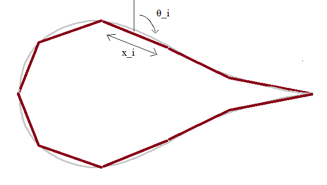
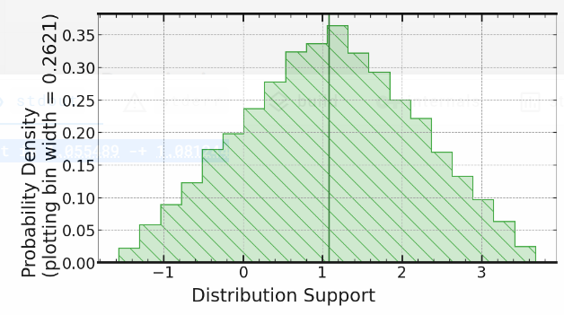
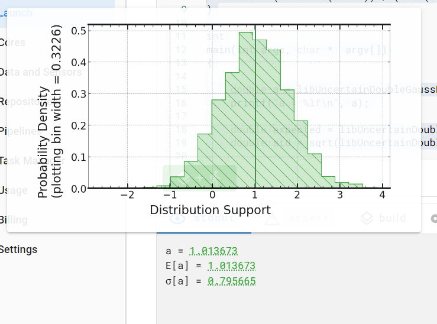
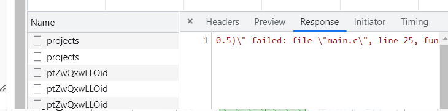

# Aerofoil lift from pitot-static readings

Demonstration of using pitot-static readings to calculate lift on an aerofoil.
I use the Signaloid cloud uncertainty propagation tool to generate uncertainty information about the value of lift I calculate.

## Fluid dynamics

I chose the simplest model for the aerofoil.
The aerofoil has a uniform cross sections

| Assumption                                  | Usefulness                                                                                                                           |
| ------------------------------------------- | ------------------------------------------------------------------------------------------------------------------------------------ |
| Uniform cross-section throughout            | Consider a single cross-section to get lift per unit length.                                                                         |
| Cross-section is a polygon shape            | Makes integration of aerofoil shape simple.                                                                                          |
| Velocity is constant across side of polygon | Allows replacing integration with summation over sides. Allows use of N point pitot-static readings to sample pressure distribution. |

These assumptions gives the following model of the aerofoil



### Calculating pressure

We use Bernouli's Equation alone a streamline to give

    p_i = (v_∞ ** 2 - v_i ** 2) / 𝜌_f + p_∞

where the `v_i`s come from from pitot-static readings, `𝜌_f` is the density of the fluid (air) passing over the wing and `p_∞` is the atmospheric pressure.
I have neglected the atmospheric pressure from all calculations as this pressure acts uniformly on the entire cross section of the wing.
The atmospheric pressure exerts exactly the same upward force and downwards force and so cannot contribute to the lift.

### Pitot-static readings

Each pitot-static reading gives a height difference `Δh_i`, I calculated `v_i` from the height difference as follows


    v_i ** 2 = 2 * 𝜌_w * g * Δh_i * K / 𝜌_f;

where `𝜌_w` is the density of the fluid in the pitot-static tube, `g` is the acceleration due to gravity and `K` is a factor to adjust for the angle of the pitot-static tube. In our case `K = 0.2`.

### Lift

[Wikipedia](https://en.wikipedia.org/wiki/Lift_(force)#Pressure_integration) gives the lift per unit length on the aerofoil as

    lift = integral( p * n * k * dS )

Using the assumptions above, I simply this integral into

    lift = sum ( - p_i * cos(θ_i) * x_i )

where `θ_i` and `x_i` are shown in the diagram of the aerofoil model above and the sum is take over each section of the aerofoil.

### Input data

I took input data from a write-up of a wind tunnel test on a NACA 0012 aerofoil [[1]].
I chose this input data as the write-up contained uncertainty estimates as well as raw input data.
The write-up also contained results (both best guess's for the lift coefficient and uncertainty results) that I could have used to verify my model and my calculations.
However, instead of doing this verification, I chose to focus my effort on the c programming and the Signaloid platform.
I found these the most interesting parts of the exercise.

[1]: https://www.researchgate.net/publication/319649582_Wind_Tunnel_Testing_of_a_NACA0012_Aerofoil/link/59b7d716a6fdcc7415c01042/download#

## Program

The program has four main parts.

1. Defining the input data. Numbers and uncertainties are taken from the write-up (see above) where available or estimated (for example the uncertainty in `params.tube_angle_adjust`).
2. A preprocessing step to convert the raw data-points (with height differences) into pressure data-points.
3. A final processing step that numerically integrates the pressure data-points to calculate the lift.
4. Printing of the lift and its error.

I found it easiest to compile and run the program locally using

    gcc src/main.c -lm -Wall -Wextra -fsanitize=undefined -Wvla -DLOCAL -fsanitize=undefined

Once I was happy with the result of running locally, I committed, pushed to github and ran the program on Signaloid via the "Repositories" tab.
Local builds gave me quick feedback on syntax and logical errors.
If I were to work further on this project I would automate the process of checking for logical errors via writing unit tests.
This would save me the work of manually inspecting the programs output after each run.

As well as running `gcc` I also ran `g++` as you get better compiler errors and warnings when in c++ mode.

### Output

> Repository commit was ea5a6e22bdc8

Running the program on signaloid (using the C0-l+ processor) I get the output

    Lift is 1.055489 -+ 1.081244

with the following distribution for lift:



Running on other processors gave the following results:

| Processor        | Result                         |
| ---------------- | ------------------------------ |
| C0-S             | `Lift is 1.057530 -+ 0.490797` |
| C0-S+            | `Lift is 1.047097 -+ 1.084021` |
| C0-M             | `Lift is 1.049199 -+ 0.492445` |
| C0-M+            | `Lift is 1.051024 -+ 1.080367` |
| C0-L             | `Lift is 1.051772 -+ 0.491748` |
| C0-L+            | `Lift is 1.055489 -+ 1.081244` |
| C0-Bypass        | (build error)                  |
| C0-Reference (1) | `Lift is 0.809613 -+ 0.000000` |
| C0-Reference (2) | `Lift is 1.254087 -+ 0.000000` |
| C0-Reference (3) | `Lift is 0.989573 -+ 0.000000` |
| C0-Reference (4) | `Lift is 0.793089 -+ 0.000000` |
| C0-Reference (5) | `Lift is 1.056263 -+ 0.000000` |
| C0-Reference (6) | `Lift is 1.720896 -+ 0.000000` |

The reference architecture gives a different answer each time, with the standard deviation of the 6 C0-Reference sample runs about `0.3`.
Autocorrelation tracking gives uncertainty twice that given without autocorrelation tracking.

The probability distribution for lift has a triangular shape when using autocorrelation tracking.
This is surprising as the lift is a sum of random variables and so I would expect its distribution to look more gaussian.

With autocorrelation tracking turned off the distribution looks much more Gaussian.
The distribution shape suggests that uncertainty of all the lift measurements have meaningful correlation with each other.
These correlations mean that the central limit theorem (which would cause the Gaussian shaped probability distribution) does not hold.


## Signloid and libUncertain

I injected uncertainty into the model by defining the inputs as uniform probability distributions using the function `libUncertainDoubleUniformDist`.
This function is undocumented but used extensively in examples.

The uncertainty in the model inputs could be more accurately represented by Gaussian distributions.
I attempted to check the affect of using Gaussian inputs (via `libUncertainDoubleGaussDist`) on the output distribution for lift.
Unfortunately I could not get Signaloid to produce sensible results when using Gaussian distributions.
For example the following program fails its assertions

```c
#include <stdio.h>
#include <uncertain.h>
#include <stdbool.h>
#include <math.h>
#include <assert.h>

bool approx_equal(double a, double b) {
    return (2 * fabs(a - b)) / (fabs(a) + fabs(b)) < 0.1;
}

int
main(int argc, char *  argv[])
{

	double a = libUncertainDoubleGaussDist(0.5, 0.8);
	printf("a = %lf\n", a);

    double expected = libUncertainDoubleNthMoment(a, 1);
    double std = sqrt(libUncertainDoubleNthMoment(a, 2));

	printf("E[a] = %lf\n", expected);

	printf("σ[a] = %lf\n", std);

    assert(approx_equal(expected, 0.5)); // fails here
    assert(approx_equal(std, 0.8));

	printf("success\n");

	return 0;
}
```

This program when run on Signaloid using the C0-L+ processor gives the following output.



Note that the mean of the distribution, as well as the best-guess is a factor of 2 out.
Signaloid does not currently show stderr or exit codes but you can infer the assertion fails as the stdout does not contain the last "success".
That the assertion fails is confirmed by the following text found within the JSON response to the HTTP REST request.



All the other processors give similar results.
As `libUncertain` is a closed source library I was not able to dig any deeper into this, instead I stuck to using `libUncertainDoubleUniformDist`.

### Signaloid cloud UX

The site is fairly simple to use, the integration with github was particularly nice.
I have some feedback on the UX -- should that be welcome -- in the file [signaloid-feedback.md](./signaloid-feedback.md).