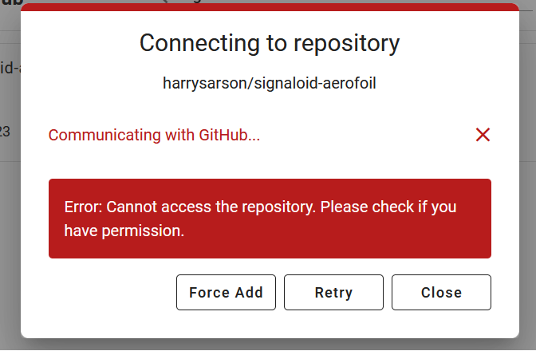

notes

## Data

Possible data source, no values for lift though

https://www.researchgate.net/publication/
330280220_Experimental_and_Numerical_Study_of_Velocity_Profile_of_Air_over_an_Aerofoil_in_a_Free_Wind_Stream_in_Wind_Tunnel

Better data, has calculated (but not measured) lift values:
https://www.researchgate.net/publication/319649582_Wind_Tunnel_Testing_of_a_NACA0012_Aerofoil

## Signaloid

When I try to import an empty repo (no commits) into signaloid I get the following error:

