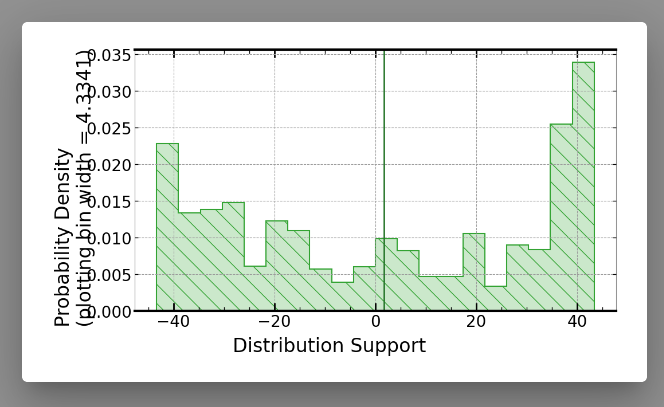

notes

## Data

Possible data source, no values for lift though

https://www.researchgate.net/publication/
330280220_Experimental_and_Numerical_Study_of_Velocity_Profile_of_Air_over_an_Aerofoil_in_a_Free_Wind_Stream_in_Wind_Tunnel

Better data, has calculated (but not measured) lift values:
https://www.researchgate.net/publication/319649582_Wind_Tunnel_Testing_of_a_NACA0012_Aerofoil

## Signaloid

### Import empty repo

When I try to import an empty repo (no commits) into signaloid I get the following error:

### Web UI stuck "uploading"

> **NOTE**: this is specific to firefox. Switching to chrome fixed the issue for me.

The WEB UI is here and stays here seemingly for ever.

In the console I see this, not sure if it is an issue or not.

### Odd negative-action button

Clicking this button logs me out from github -- which is slightly odd behaviour.

Clicking this button umounts the storage -- given the button is a happy green button with a tick that seems suprising.

### Docs

#### Create uncertain values

Here I would expect to read how to create an uncertain value from a best guess and a standard deviation, or from upper and lower bounds.
There is probably a good reason why those functions don't live here but a mention of them in the docs would have helped me.

From the demos I found the function `libUncertainDoubleUniformDist`, which is documented here (you can find it by searching):

If it is used in the demos it probably should be publicly documented.

### Running code on siganloid

> These runs are with commit 8d1c4a2c423a02

- Local runs give a best guess of 42.
- C0-Reference gives answers in range `[-30,30]`.
- C0-L+ gives a best guess of 14.8 but then a probability distribution that does not agree.
  The green line (presumably the mean) is at 2.
  
- C0-bypass did not work at all.
  C0-bypass does not work for hello world examples either. Oops.
  
- C0 gives a answers in the range `[-40, 40]`
- Presumably I have accidentally inserted some massive uncertainty into the model that makes everything fall over.

