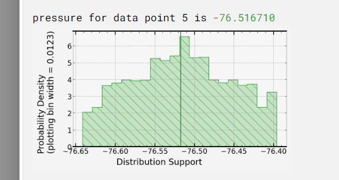

# notes

Collection of more raw thoughts as I worked through this problem.

## Data

Possible data source, no values for lift though

https://www.researchgate.net/publication/
330280220_Experimental_and_Numerical_Study_of_Velocity_Profile_of_Air_over_an_Aerofoil_in_a_Free_Wind_Stream_in_Wind_Tunnel

Better data, has calculated (but not measured) lift values:
https://www.researchgate.net/publication/319649582_Wind_Tunnel_Testing_of_a_NACA0012_Aerofoil

## Docs

### Create uncertain values

Here I would expect to read how to create an uncertain value from a best guess and a standard deviation, or from upper and lower bounds.
There is probably a good reason why those functions don't live here but a mention of them in the docs would have helped me.

From the demos I found the function `libUncertainDoubleUniformDist`, which is documented here (you can find it by searching):

If it is used in the demos it probably should be publicly documented.

## Running code on siganloid

### commit 8d1c4a2c423a02

- Local runs give a best guess of 42.
- C0-Reference gives answers in range `[-30,30]`.
- C0-L+ gives a best guess of 14.8 but then a probability distribution that does not agree.
  The green line (presumably the mean) is at 2.
  
- C0-bypass did not work at all.
  C0-bypass does not work for hello world examples either. Oops.
  
- C0 gives a answers in the range `[-40, 40]`
- Presumably I have accidentally inserted some massive uncertainty into the model that makes everything fall over.

### commit ff8680792bb2

This commits logs the pressure at each datapoint.

- C0-L+ gives numbers for the pressure that agrees with local builds and has sensible uncertainty.
  
- The final result still makes no sense, something must go wrong in the numerical integration step.

### commit 078ed1d37f41

This commit logs the lift at each datapoint.

- C0-L+ gives nonsense numbers for the lift at each datapoint.
  You see the local results and the signaloid results compared.
  The signaloid numbers make no sense.
  Why not?
  

### commit 080955220159f16a4

This commits removes the cosine, removing would be correct if all the angles are 0.

- C0-L+ gives **sensible** lift numbers again!
  
- The implementation of uncertainty propagation through the cosine function must be buggy.
- Found the error, it was my fault.
  Sorry for being to quick to blame uncertainty propagation through cosine.
- My error in the angles was 200 times `2 * pi` rather than being a 200th of `2 * pi`.
- No wonder the results were all over the place.

### commit 8a27d670b48bef0

This commit adds the cosine back in and fixes the errors in the angles.

- Now C0-L+ gives and answer that matches the local results and also gives a sensible probability distribution.
  