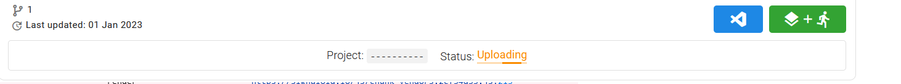
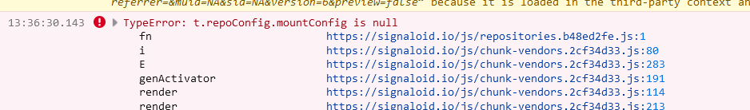
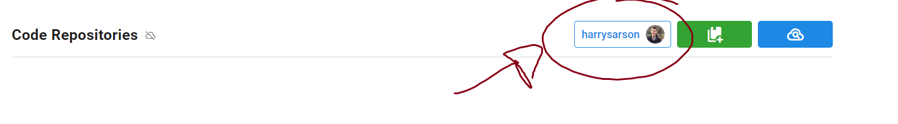

## Signaloid

### Import empty repo

When I try to import an empty repo (no commits) into signaloid I get the following error:

### Web UI stuck "uploading"

> **NOTE**: this is specific to firefox. Switching to chrome fixed the issue for me.

The WEB UI is here and stays here seemingly for ever.

In the console I see this

### Odd negative-action buttons

Clicking this button logs me out from github -- which is slightly odd behaviour.

Clicking this button umounts the storage -- given the button is a happy green button with a tick that seems suprising.

Clicking this button unlinks the repo -- again the button is green so I kept clicking it by accident.

### Misleading run time icons

These icons indicate "time since task ran", you can be sure of this because the times increase when you refresh the page.
I initially assumed that they instead showed the duration of the task.
The UI should probably make this clearer.

### Cannot define via command line arguments

I have tried using `-DGAUSSIAN` in the command line arguments box but it does not seem to have any effect when the program is compiled.

